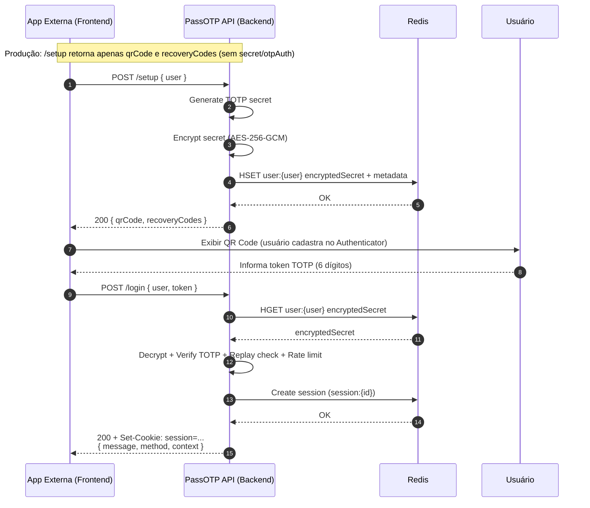
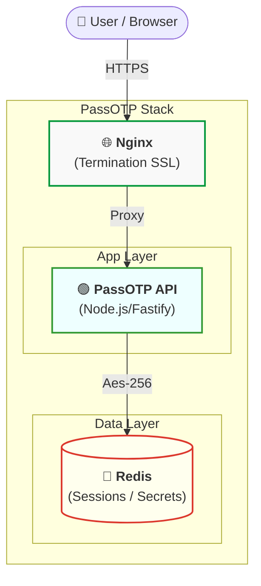

# PassOTP 🛡️
> **Drop-in, Self-Hosted MFA Microservice for Modern Apps.**
> Adicione TOTP (Google Authenticator) e Passkeys (Biometria) à sua aplicação em minutos, com segurança bancária "out-of-the-box".

[](docker-compose.yml)
[](src/server.ts)
[](src/services/encryption.service.ts)
[](LICENSE)

**PassOTP** é um microserviço *opinionated* desenhado para ser a camada de autenticação secundária (2FA) da sua infraestrutura. Ao invés de reimplementar lógica complexa de criptografia, proteção contra replay e rate-limiting, você delega isso ao PassOTP e foca no seu produto.

- 🚀 **Pronto para Produção**: Rate Limiting, Replay Protection, AES-256 em repouso.
- 🐳 **Docker-Native**: Rode com um comando (`docker-compose up`).
- 🔑 **Passwordless**: Suporte nativo a **Passkeys** (FIDO2/WebAuthn).

---

## ⚡ Por que PassOTP?

Implementar MFA corretamente é difícil. Bibliotecas como `speakeasy` ou `otplib` dão as ferramentas, mas não o **sistema**. Você ainda precisa resolver:
- *Onde guardar o segredo?* (Texto plano no banco = falha crítica)
- *Como impedir que usem o mesmo código 2x?* (Replay Attack)
- *Como evitar força bruta?* (Rate Limiting)
- *Como gerenciar sessões seguras?*

**PassOTP resolve tudo isso.** Ele encapsula a complexidade em uma API REST simples e segura.

---

## ✨ Features (Hardening)

- **Criptografia em Repouso**: Segredos TOTP são encriptados com **AES-256-GCM** antes de tocar o Redis.
- **Proteção de Replay**: Impede o reuso de tokens válidos dentro da mesma janela de tempo (`SET NX` atômico).
- **Rate Limiting Inteligente**:
    - **Por IP**: Mitiga DDoS.
    - **Por Usuário**: Mitiga Credential Stuffing.
- **Privacy-First**: Proteção contra Enumeração de Usuários e Timing Attacks (resposta com delay constante).
- **Sessão Segura**: Cookies `HttpOnly`, `Secure` e `SameSite=Lax/Strict`.
- **WebAuthn "Secure-by-Default"**: Exige User Verification (Biometria/PIN) em produção.

---

## 🚀 Quickstart (5 Minutos)

Pré-requisitos: Docker e Docker Compose.

1.  **Clone e Configure**:
    ```bash
    git clone https://github.com/seu-user/passotp.git
    cd passotp
    cp .env.example .env
    ```

2.  **Suba o Serviço**:
    ```bash
    docker-compose up -d --build
    ```

3.  **Teste**:
    Acesse **http://localhost** para ver a UI de demonstração incluída.
    - Cadastre um usuário (`user@test.com`).
    - Escaneie o QR Code.
    - Faça Login com o código.

---

## 🔌 Integração (Backend-to-Backend)

Sua aplicação ("Consumer App") conversa com o PassOTP via API REST interna (porta 3000 ou via proxy).

### Arquitetura de Referência
O PassOTP assume a responsabilidade de *gerar*, *armazenar* e *validar* os fatores de autenticação.



### Segurança do Fluxo
Observe que **o segredo TOTP nunca sai do PassOTP** em produção. O cliente recebe apenas a imagem do QR Code. A validação ocorre internamente.

---

## 📚 API Reference

Endpoints essenciais para integração.

### 1. Setup (Ativar MFA)
Gera o segredo, salva encriptado e retorna o QR Code.

**Request:** `POST /setup`
```json
{ "user": "usuario@exemplo.com" }
```

**Response (Prod):**
```json
{
  "qrCode": "data:image/png;base64,...", 
  "recoveryCodes": ["A1B2-C3D4", ...]
}
```

### 2. Login (Validação)
Endpoint principal. Valida o token (TOTP ou Recovery) e cria a sessão.

**Request:** `POST /login`
```json
{ "user": "usuario@exemplo.com", "token": "123456" }
```

**Response (200 OK):**
```json
{
  "success": true,
  "message": "Login realizado!",
  "meta": { "method": "TOTP_APP" }
}
```

### 3. Verify (Dev/Test Only)
⚠ **Desabilitado em Produção.** Útil apenas para testes manuais ou scripts de CI incontrolados.

---

## 🆚 Comparações: Quando usar PassOTP?

### A. vs Bibliotecas (`otplib`, `speakeasy`)
| Feature | Bibliotecas | PassOTP 🛡️ |
|---------|-------------|-------------|
| **Escopo** | Funções (gerar tokens, verificar) | Sistema Completo (API, DB, Sessão) |
| **Persistência** | Não (você implementa) | Sim (Redis + AES-256) |
| **Replay Protection** | Não (você implementa) | Sim (Built-in) |
| **Rate Limiting** | Não | Sim (IP + User) |

### B. vs IAM Suites (`Keycloak`, `Authentik`)
| Feature | IAM Suites | PassOTP 🛡️ |
|---------|------------|-------------|
| **Foco** | Identidade Completa (SSO, Users) | Apenas MFA/2FA |
| **Peso** | Pesado (Java, múltiplos containers) | Leve (Microserviço Node.js) |
| **Integração** | Complexa (OIDC/SAML) | Simples (REST API) |
| **Controle** | Opinião forte sobre users | Você controla seus usuários |

### C. vs SaaS (`Auth0`, `Okta`)
| Feature | SaaS Auth | PassOTP 🛡️ |
|---------|-----------|-------------|
| **Custo** | Por MAU (Monthly Active User) | Custo fixo (sua infra) |
| **Dados** | Proprietário (Vendor Lock-in) | Seus dados, sua privacidade |
| **Setup** | Instantâneo | Requer Docker host |

### Veredito
✅ **Escolha PassOTP se:**
- Você já tem usuários e só quer adicionar 2FA.
- Você quer controle total dos dados e segredos.
- Você precisa de conformidade (logs, rate limit) sem pagar SaaS caro.
- Você usa arquitetura de microserviços.

❌ **NÃO escolha PassOTP se:**
- Você precisa de um gestão completa de usuários (SignUp, Forgot Password, SSO). (Use Keycloak/Auth0)
- Você não quer gerenciar infraestrutura Docker/Redis.

---

## 🛠️ Modo Dev vs Prod

Flags de "Break-glass" para desenvolvimento. **Evite em produção**.

| Variável | Prod Default | Risco |
|----------|--------------|-------|
| `ALLOW_DEBUG_SETUP_OUTPUT` | `false` | Se `true`, `/setup` retorna secret cru. |
| `ENABLE_DEV_VERIFY_ENDPOINT` | `false` | Se `true`, habilita `/verify`. |
| `I_KNOW_WHAT_IM_DOING` | `false` | Trava de segurança obrigatória. |

---

## ✅ Go-Live Checklist

Antes de ir para produção:
1.  [ ] **HTTPS**: Configure SSL no Nginx ou Load Balancer.
2.  [ ] **Env**: `NODE_ENV=production`.
3.  [ ] **Chaves**: `ENCRYPTION_KEY` gerada segura (32 bytes).
4.  [ ] **Segredos**: `SESSION_SECRET` forte.
5.  [ ] **CORS**: `FRONTEND_ORIGIN` restrito ao seu domínio.
6.  [ ] **WebAuthn**: `WEBAUTHN_REQUIRE_UV=true`.

---

## 🏗️ Arquitetura (Infraestrutura)



## 📜 Licença
MIT
